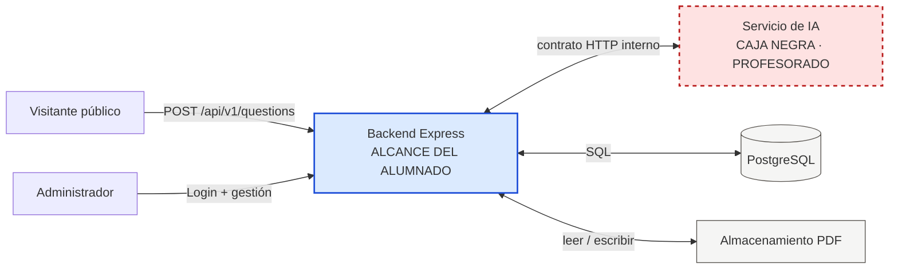

```mermaid
%% Reference system-context diagram for Topic 01 — Project Kickoff.
%% Used as the guided example inside README.md (Ejemplo guiado section).
%% Teams produce their own version as Activity 4; the required element list
%% is documented in exercises/system-diagram-template.md.
flowchart LR
    visitor[Visitante público]
    admin[Administrador]
    backend[Backend Express<br/>ALCANCE DEL ALUMNADO]
    ai[Servicio de IA<br/>CAJA NEGRA · PROFESORADO]
    db[(PostgreSQL)]
    pdf[Almacenamiento PDF]

    visitor -->|POST /api/v1/questions| backend
    admin -->|Login + gestión| backend
    backend <-->|contrato HTTP interno| ai
    backend <-->|SQL| db
    backend <-->|leer / escribir| pdf

    classDef student fill:#dbeafe,stroke:#1d4ed8,stroke-width:2px
    classDef teacher fill:#fee2e2,stroke:#b91c1c,stroke-width:2px,stroke-dasharray:5 5
    classDef store fill:#f5f5f4,stroke:#57534e,stroke-width:1px

    class backend student
    class ai teacher
    class db,pdf store
```
