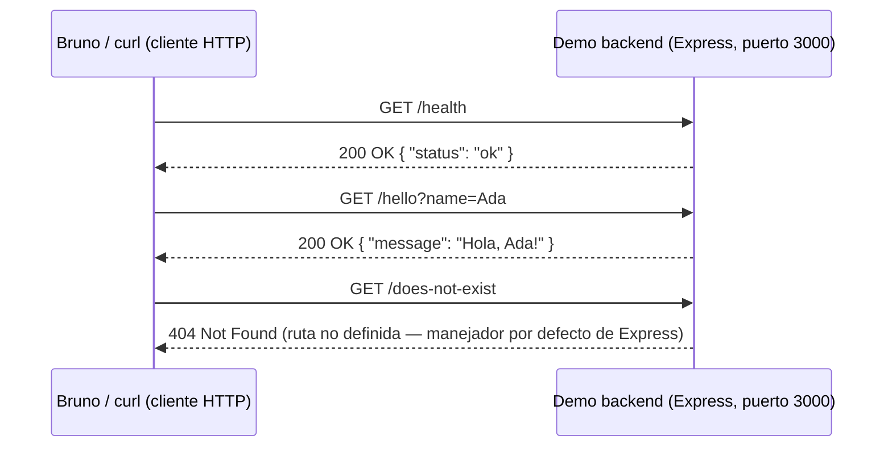

```mermaid
sequenceDiagram
    participant B as Bruno / curl (cliente HTTP)
    participant S as Demo backend (Express, puerto 3000)

    B->>S: GET /health
    S-->>B: 200 OK  { "status": "ok" }

    B->>S: GET /hello?name=Ada
    S-->>B: 200 OK  { "message": "Hola, Ada!" }

    B->>S: GET /does-not-exist
    S-->>B: 404 Not Found  (ruta no definida — manejador por defecto de Express)
```
