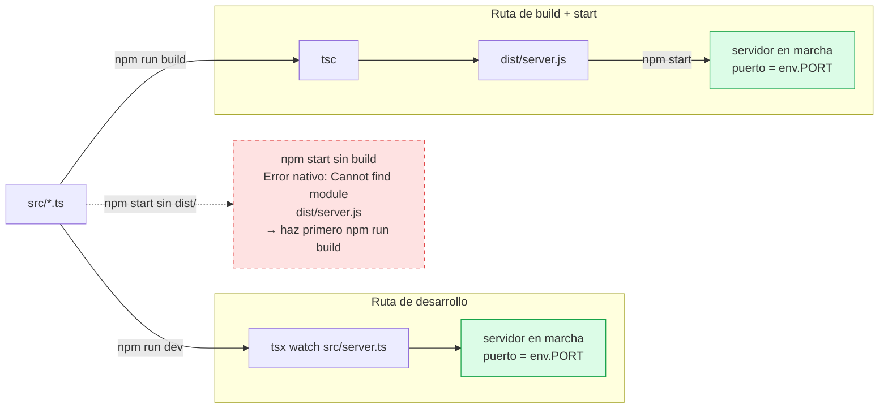

```mermaid
%% Reference diagram for Topic 03 — TypeScript and Express Setup.
%% Shows the two runnable paths students must distinguish:
%%   (dev)   npm run dev   → tsx watch on src/*.ts (no dist/ produced)
%%   (build) npm run build → tsc → dist/*.js  → npm start runs dist/server.js
%%            start never compiles: without a prior build, node fails with
%%            the native error "Cannot find module .../dist/server.js"
flowchart LR
    src[src/*.ts]

    subgraph DEV[Ruta de desarrollo]
        tsx[tsx watch src/server.ts]
        devServer[servidor en marcha<br/>puerto = env.PORT]
    end

    subgraph BUILD[Ruta de build + start]
        tsc[tsc]
        dist[dist/server.js]
        prodServer[servidor en marcha<br/>puerto = env.PORT]
    end

    err[npm start sin build<br/>Error nativo: Cannot find module<br/>dist/server.js<br/>→ haz primero npm run build]

    src -->|npm run dev| tsx --> devServer
    src -->|npm run build| tsc --> dist
    dist -->|npm start| prodServer
    src -.->|npm start sin dist/| err

    classDef okPath fill:#dcfce7,stroke:#16a34a
    classDef failPath fill:#fee2e2,stroke:#dc2626,stroke-dasharray:5 5

    class devServer,prodServer okPath
    class err failPath
```
