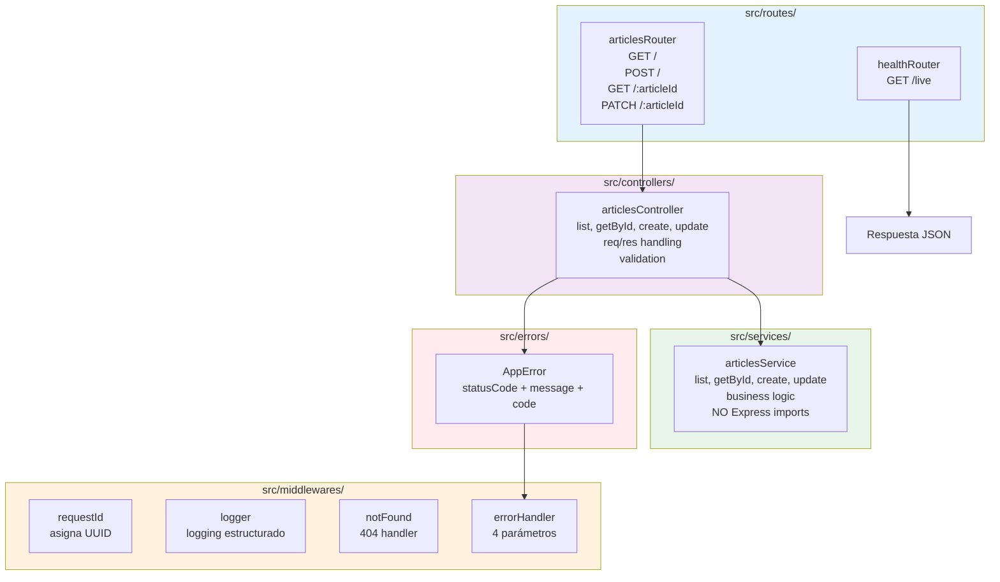

```mermaid
graph TD
    subgraph Routes [src/routes/]
        HR[healthRouter<br/>GET /live]
        AR[articlesRouter<br/>GET /<br/>POST /<br/>GET /:articleId<br/>PATCH /:articleId]
    end

    subgraph Controllers [src/controllers/]
        AC[articlesController<br/>list, getById, create, update<br/>req/res handling<br/>validation]
    end

    subgraph Services [src/services/]
        AS[articlesService<br/>list, getById, create, update<br/>business logic<br/>NO Express imports]
    end

    subgraph Middleware [src/middlewares/]
        RID[requestId<br/>asigna UUID]
        LOG[logger<br/>logging estructurado]
        NF[notFound<br/>404 handler]
        EH[errorHandler<br/>4 parámetros]
    end

    subgraph Errors [src/errors/]
        AE[AppError<br/>statusCode + message + code]
    end

    HR --> RESP[Respuesta JSON]
    AR --> AC
    AC --> AS
    AC --> AE
    AE --> EH

    style Routes fill:#e3f2fd
    style Controllers fill:#f3e5f5
    style Services fill:#e8f5e9
    style Middleware fill:#fff3e0
    style Errors fill:#ffebee
```
