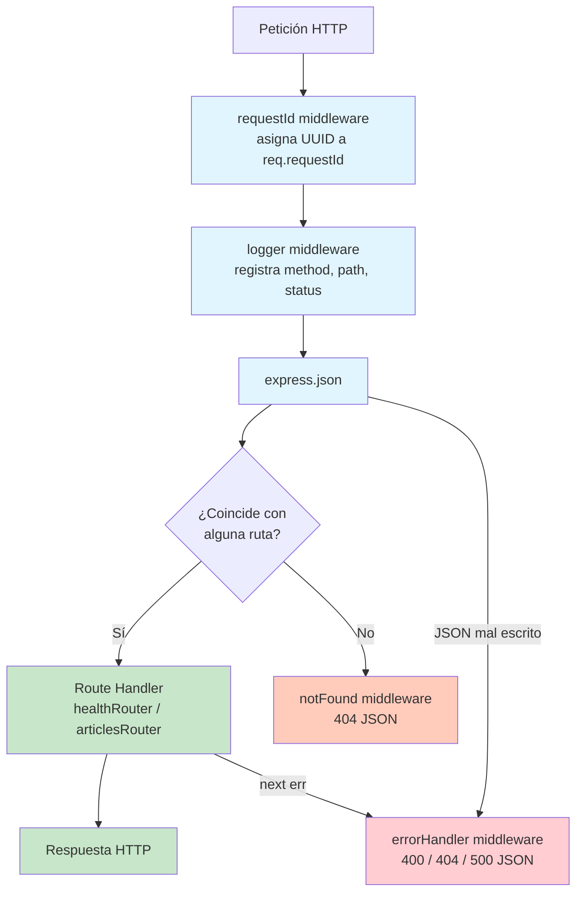

```mermaid
graph TD
    REQ[Petición HTTP] --> REQID[requestId middleware<br/>asigna UUID a req.requestId]
    REQID --> LOG[logger middleware<br/>registra method, path, status]
    LOG --> JSON[express.json]
    JSON --> ROUTE{¿Coincide con<br/>alguna ruta?}

    ROUTE -->|Sí| HANDLER[Route Handler<br/>healthRouter / articlesRouter]
    HANDLER --> RESP[Respuesta HTTP]

    ROUTE -->|No| NOTFOUND[notFound middleware<br/>404 JSON]

    JSON -->|JSON mal escrito| ERR[errorHandler middleware<br/>400 / 404 / 500 JSON]
    HANDLER -->|next err| ERR

    style JSON fill:#e1f5fe
    style REQID fill:#e1f5fe
    style LOG fill:#e1f5fe
    style NOTFOUND fill:#ffccbc
    style ERR fill:#ffcdd2
    style HANDLER fill:#c8e6c9
    style RESP fill:#c8e6c9
```
