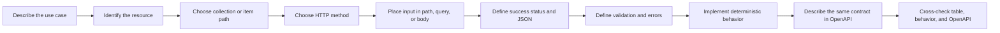

```mermaid
flowchart LR
    A[Describe the use case] --> B[Identify the resource]
    B --> C[Choose collection or item path]
    C --> D[Choose HTTP method]
    D --> E[Place input in path, query, or body]
    E --> F[Define success status and JSON]
    F --> G[Define validation and errors]
    G --> H[Implement deterministic behavior]
    H --> I[Describe the same contract in OpenAPI]
    I --> J[Cross-check table, behavior, and OpenAPI]
```
